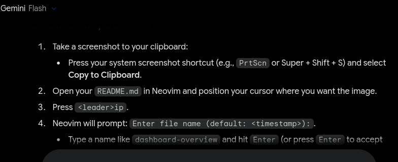
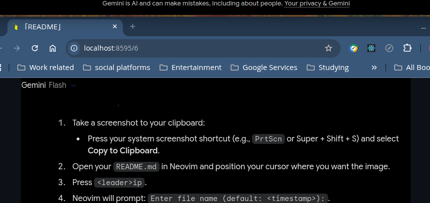

# 🏷️ VimForge

## 📌 This is a heading

#### 🔹 This is a heading

### 📦 This is a heading

---

| Feature     | Tech           | Status |
|-------------|----------------|--------|
| Terminal UI | Rust (ratatui) | Active |

| Feature     | Tech           | Status |
|-------------|----------------|--------|
| Terminal UI | Rust (ratatui) | Active |

1. Item 1
2. item 2
3. item 3

- item 1
- item 2
- item 3

- item 1
    - item 2
    - item 3

- [ ] Task 1
- [ ] Task 2

---

**This is bold**

_This is italics_

---

